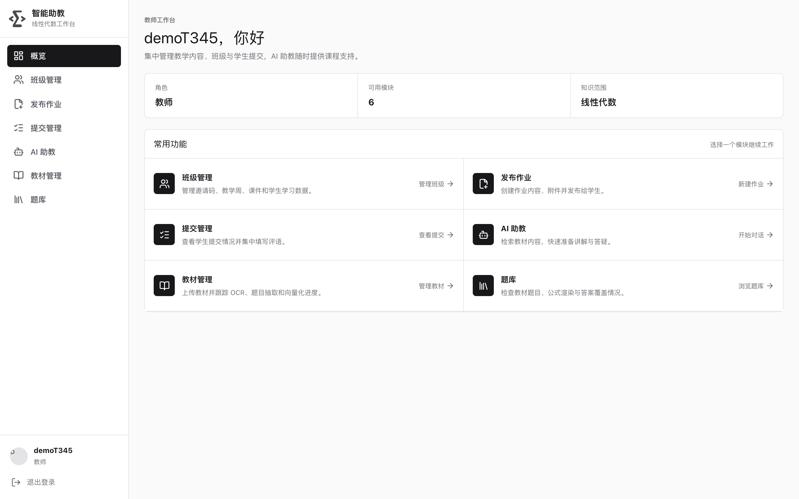
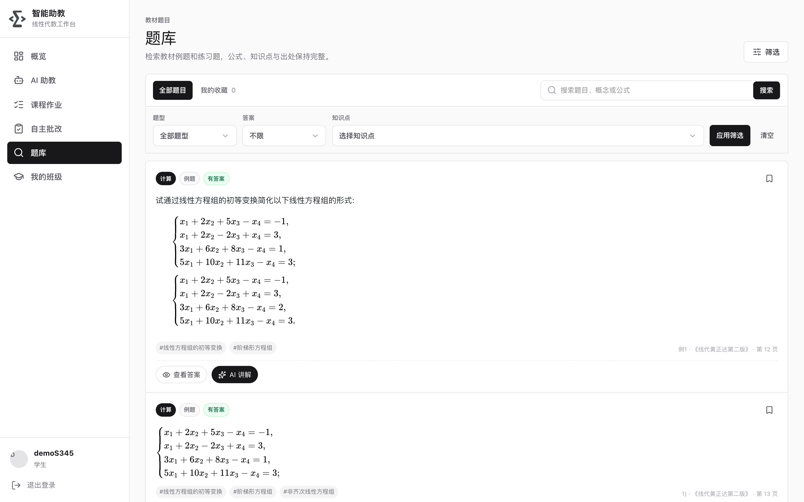
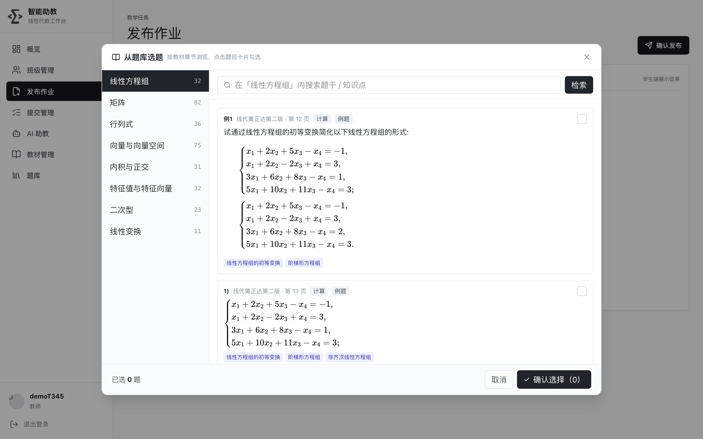
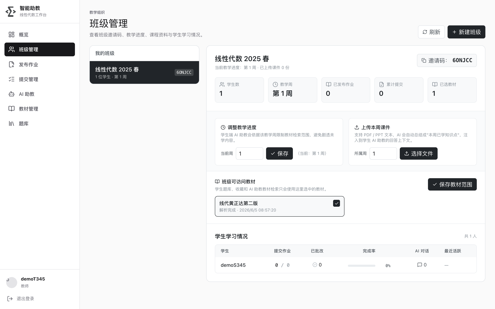
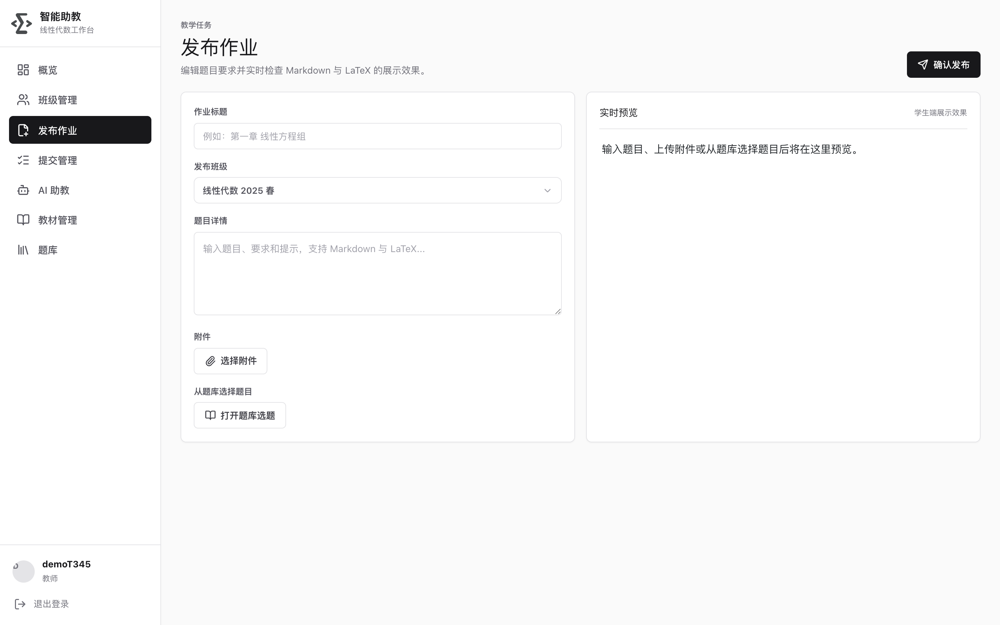

# 线性代数 AI 助教系统

面向高校线性代数课程的 **AI 辅助教学平台**：学生侧有 RAG 教材问答、题目 AI 讲解、作业自主批改与 3D 几何可视化；教师侧有班级管理、资料访问控制、题库分章选题与作业发布。

> 技术栈：**React + Vite + Tailwind**（前端） · **Go + Gin + GORM**（业务后端） · **Python + FastAPI**（AI 推理/教材解析） · **PostgreSQL + pgvector**（向量检索）。

---

## ✨ 核心功能

- **AI 助教问答**：基于教材向量库（RAG）的对话答疑，公式 LaTeX 渲染，回答附「参考教材」出处可展开。
- **题库**：教材例题/习题入库，按章节浏览 + 语义/关键词混合检索 + 知识点标签筛选 + 收藏。
- **作业闭环**：教师发布作业（手写题 / PDF 附件 / **题库分章选题**三种并存）→ 学生提交 → AI/教师批改；学生「自主批改」可直接选老师发布的作业为题源。
- **题目 AI 讲解**：学生在题库一键「AI 讲解」，以题目为上下文生成讲解并落成可继续追问的会话。
- **教师录入答案**：题目答案/解析由老师录入后展示给本班学生（不做 AI 生成）。
- **资料访问控制**：教材对教师是公共资源；学生的题库、收藏与 RAG 检索范围**仅限其所在班级被分配的教材**。
- **课本解析流水线**：PDF / PPT / Word（LibreOffice 转换）→ 视觉模型 OCR → 分块向量化 → 并发抽题 + 受控知识点标注。
- **3D 可视化**：向量、矩阵变换等几何可视化引擎。

---

## 📸 项目展示

**工作台（登录后总览）**


**题库（公式渲染 · 知识点标签 · 查看答案 / AI 讲解）**


**发布作业 · 从题库按章节选题**


**班级管理 · 教学进度 · 资料访问控制**


**发布作业（手写 / 附件 / 题库选题 + 实时预览）**


---

## 🏗️ 架构

```
浏览器 ──> nginx ──/──> frontend/dist (静态)
                 └──/api──> Go web_service :8080 ──HTTP──> ai_service :8000 ──> 大模型(aihubmix)
                                  └──────────────────────> PostgreSQL + pgvector :5432
```

- `frontend/`：React + Vite + TailwindCSS，KaTeX 公式渲染，3D 可视化。
- `web_service/`：Go + Gin + GORM，负责鉴权（JWT）、班级/作业/题库转发/收藏、文件服务，转发调用 ai_service。
- `ai_service/`：Python + FastAPI，负责对话、RAG 检索、OCR、教材解析与抽题、题库混合检索（模型路由见 `ai_service/model_config.json`）。

---

## 🚀 本地开发启动

需要 **Docker、Go 1.24+、Python 3.9+、Node 20+**。

```bash
# 0) 配置统一环境变量（仓库根目录 .env，两端服务都会加载）
cp deploy/.env.example .env       # 填 DB 密码、JWT_SECRET、AI_API_KEY

# 1) 启动数据库（PostgreSQL 15 + pgvector，数据持久化到命名卷）
DB_PASSWORD=<与 .env 一致> bash deploy/run-db.sh
#    表结构 / 向量索引在服务首次启动时自动创建，无需手动建表

# 2) AI 服务（:8000）
cd ai_service && python3 -m venv .venv && ./.venv/bin/pip install -r requirements.txt
./.venv/bin/python -m uvicorn main:app --reload --port 8000

# 3) 业务后端（:8080）
cd web_service && go run main.go

# 4) 前端（:5173）
cd frontend && npm install && npm run dev
```

打开终端打印的前端地址（通常 `http://localhost:5173/`）即可使用。

> ⚠️ 切勿对已有数据库执行 `init_v2.sql`——其首行 `DROP SCHEMA public CASCADE` 会清空整库，仅用于空库初始化。

---

## 📦 生产部署

裸机/云服务器完整部署（系统依赖、swap、pgvector、systemd 常驻、nginx 反代、HTTPS、上线前安全 checklist、**不删库的更新与回滚**、备份）见：

**👉 [`deploy/DEPLOY.md`](deploy/DEPLOY.md)**

`deploy/` 目录还提供：`.env.example`（环境变量模板）、`run-db.sh`、`build-app.sh`、`nginx-la.conf`、`systemd/*.service`。

---

## 📁 目录结构

```
.
├── frontend/        # React + Vite 前端
├── web_service/     # Go + Gin 业务后端
├── ai_service/      # Python + FastAPI AI 服务（含 model_config.json）
├── deploy/          # 部署指南、脚本与配置
├── docs/screenshots # README 展示图
├── init_v2.sql      # 空库初始化脚本（⚠️ 会清库，勿用于生产）
└── .env             # 统一环境变量（不提交，见 deploy/.env.example）
```
